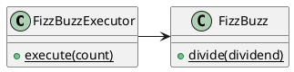
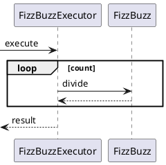

---
markdown:
  image_dir: ./assets/fizz_buzz
  path: ./fizz_buzz.md
  ignore_from_front_matter: true
  absolute_image_path: false
---

Fizz Buzz
---

## 仕様
+ ３で割り切れる場合は「Fizz」を出力する。
+ ５で割り切れる場合は「Buzz」を出力する。
+ 両者で割り切れる場合は「FizzBuzz」を出力する。
+ 指定された回数だけ繰り返し実行する。

## 設計
### TODOリスト
+ [x] ~~割り算機能~~
  + [x] ${3}\div{3}=Fizz$
  + [x] ${5}\div{5}=Bizz$
  + [x] ${15}\div{3}=FizzBuzz$
  + [x] ${15}\div{5}=FizzBuzz$
+ [x] ~~実行機能~~
  + [x] 100回繰り返し実行する
  + [x] 15回繰り返し実行する
+ [x] ~~３または５で割り切れない場合はどうするか~~
  + [x] nilを返す
+ [x] ~~繰り返し実行する機能と計算する機能を分離する~~

### クラス図

### シーケンス図

## 実装
### `FizzBuzzTest`
@import "../../spec/fizz_buzz/fizz_buzz_spec.rb"
### `FizzBuzzExecutorTest`
@import "../../spec/fizz_buzz/fizz_buzz_executor_spec.rb"
### `FizzBuzz`
@import "../../lib/fizz_buzz/fizz_buzz.rb"
### `FizzBuzzExecutor`
@import "../../lib/fizz_buzz/fizz_buzz_executor.rb"

## [イテレーション１](https://github.com/k2works/etude_for_ruby/blob/feature/fizz_buzz/docs/dev/fizz_buzz.md#L396)
## [イテレーション２](https://github.com/k2works/etude_for_ruby/blob/c21177218ec754274d170775613bd4adcdfe75d6/docs/dev/fizz_buzz.md)
## イテレーション３

### ふりかえり

#### KEEP
+ 全般
  + 前回のふりかえりの繰越をする。
+ 設計
  + **一つのプログラムには一つのことをうまくやらせる**基本定理に従い**単一責任の原則**に沿ったクラス設計をを実施した。
  + **できるだけ早く試作する**ために**インクリメンタルな設計**を**テストファーストプログラミング**で取り組むための**TODOリスト**を作成した。
+ 実装
  + **TODOリスト**に従い**テストファースト**で**一歩を示すテスト**を作成した
  + まず**はじめのテスト**を**アサートファースト**で取り掛かり**ベイビーステップ**ですすめて行った。
  + 何を書くべきかわかっているときは、**明白な実装**を行い、わからないときには**仮実装**を行い、まだ正しい実装が見えてこないときには**三角測量**を行いながら**仮実装を経て本実装へ**と進めた。
  + **コードの臭い**のする実装に対して**リファクタリングカタログ**より適切なリファクタリングを適用した。

#### PROBLEM

#### TRY
+ 実装
  + 言語仕様
    + nilを理解する

||||#1|#2|
|:---|:---|:---|:---|:---|
|原則|||
||基本定理||
|||スモール・イズ・ビューティフル|
|||一つのプログラムには一つのことをうまくやらせる|o|
|||できるだけ早く試作する|o|
|||効率より移植性|
|||数値データはASCIIフラットファイルに保存する|
|||ソフトウェアの梃子を有効に活用する|
|||シェルスクリプトを使うことで梃子の効果と移植性を高める|
|||過度の対話的インタフェースを避ける|
|||すべてのプログラムをフィルタにする|
||アプリケーション設計原則||
|||単一責任の原則(SRP)|o|o|
|||オープン・クローズドの原則(OCP)|
|||リスコフの置換原則(LSP)|
|||依存関係逆転の原則(DIP)|
|||インタフェース分離の原則(ISP)|
||パッケージ設計の原則||
|||再利用・リリース等価の原則(REP: Reuse-Release Equivalency)|
|||全再利用の原則(CRP: Common Reuse Principle)|
|||閉鎖性共通の原則(CCP: Common Closure Principle)|
|||非循環依存関係の原則(ADP: Acyclic Dependencies Principle)|
|||安定依存の原則(SDP: Stable Dependencies Principle)|
|||安定度・抽象度等価の原則(SAP: Stable Abstractions Principle)|
||プログラミング原則||
|||KISS (Keep It Simple, Stupid. or Keep It Short and Simple)||o
|||DRY (Don't Repeat Yourself.)|
|||YAGNI (You Aren't Going to Need It.)|o|
|||PIE (Program Intently and Expressively.)|
|||SLAP(Single Level of Abstraction Principle.)|
||XPの原則||
|||人間性|
|||経済性|
|||相互利益|
|||自己相似性|
|||改善|
|||多様性|
|||ふりかえり|o|
|||流れ|
|||機会|
|||冗長性|
|||失敗|
|||品質|
|||ベイビーステップ|o|
|||責任の引受|
|パターン|||
||テスト駆動開発のパターン||
|||テスト(名詞)|
|||独立したテスト|
|||TODOリスト|o|o
|||テストファースト|o|
|||アサートファースト|o|
|||テストデータ|
|||明示的なデータ|
||レッドバーのパターン|
|||一歩を示すテスト|o|
|||はじめのテスト|o|
|||説明的なテスト|
|||学習用テスト|
|||脱線はTODOリストへ|
|||回帰テスト|
|||休憩|
|||やり直す|
|||安い椅子に良い椅子|
||テスティングのパターン|
|||小さいテスト|
|||Mock Object(偽装オブジェクト)パターン|
|||Self Shunt(自己接続)パターン|
|||Long String(記録用文字列)パターン|
|||Crash Test Dummy(衝突実験ダミー人形)パターン|
|||失敗させたままのテスト|
|||きれいなチェックイン|
||グリーンバーのパターン|
|||仮実装を経て本実装へ|o|o|
|||三角測量|o|
|||明白な実装|o|
|||一から多へ|
||xUnitのパターン|
|||アサーション|o|
|||フィクスチャー|
|||外部フィクスチャー|
|||テストメソッド|o|
|||例外のテスト|
|||まとめてテスト|
||デザインパターン|
|||Commandパターン|
|||Value Objectパターン|
|||Null Objectパターン|
|||Template Methodパターン|
|||Pluggable Objectパターン|
|||Factory Methodパターン|
|||Imposterパターン|
|||Collecting Parameterパターン|
|||Singletonパターン|
|実践|||
||XP||
||主要プラクティス   |     |     |     |     |     |     |     |
||                |全員同席|     |     |     |     |     |     |
||                |チーム全体|     |     |     |     |     |     |
||                |情報満載のワークスペース|     |     |     |     |     |     |
||                |いきいきとした仕事|     |     |     |     |     |     |
||                |ペアプログラミング|     |     |     |     |     |     |
||                |ストーリー|o     |     |     |     |     |     |
||                |週次サイクル|o     |     |     |     |     |     |
||                |四半期サイクル|     |     |     |     |     |     |
||                |ゆとり|     |     |     |     |     |     |
||                |１０分ビルド|     |     |     |     |     |     |
||                |継続的インテグレーション|    |     |     |     |     |     |
||                |テストファーストプログラミング|o    |     |     |     |     |     |
||                |インクリメンタルな設計|o     |     |     |     |     |     |
||導出プラクティス
||                |本物の顧客参加|     |     |     |     |     |     |
||                |インクリメンタルなデプロイ|     |     |     |     |     |     |
||                |チームの継続|     |     |     |     |     |     |
||                |チームの縮小|     |     |     |     |     |     |
||                |根本原因分析|     |     |     |     |     |     |
||                |コードの共有|     |     |     |     |     |     |
||                |コードとテスト|     |     |     |     |     |     |
||                |単一のコードベース|     |     |     |     |     |     |
||                |デイリーデプロイ|     |     |     |     |     |     |
||                |交渉によるスコープ契約|     |     |     |     |     |     |
||リファクタリング|
|||差異をなくす|
|||変更の分離|
|||データ構造の変更|
|||メソッドの抽出|
|||メソッドのインライン化|
|||インタフェースの抽出|
|||メソッドの移動|
|||メソッドオブジェクト|
|||パラメータの追加|
|||メソッドからコンストラクタへのパラメータの移動|
||コードの臭い||
|||コードの重複|
|||長いメソッド|
|||大きなクラス|
|||長い引数リスト|
|||変更系統の分岐|
|||ショットガン創の手術|
|||メソッドの浮気|
|||群れたがるデータ|
|||プリミティブ強迫症|
|||case文|
|||パラレルな継承階層|
|||仕事をしないクラス|
|||空論的一般化|
|||一時フィールド|
|||メッセージの連鎖|
|||横流しブローカー|
|||親密すぎるクラス|
|||インターフェイスの異なるクラス群|
|||不完全なライブラリクラス|
|||データクラス|
|||継承した遺産の拒絶|
|||コメント|
|||メタプログラミング狂|
|||柔軟過ぎるAPI|
|||紋切り型コードく繰り返し|
||リファクタリングカタログ|
|||メソッドの構成方法|
|||メソッドの抽出(Extract Method)|
|||メソッドのインライン化(Inline Method)|
|||一時変数のインライン化(Inline Temp)|
|||一時変数から問い合わせメソッドへ(Replace Temp with Query)|
|||一時変数からチェインへ(Replace Temp with Query)|
|||説明変数の導入(Introduce Explaining Variable)|
|||一時変数の導入(Split Temporary Variable)|
|||引数への代入の除去(Remove Assignments to Parameters)|
|||メソッドからメソッドオブジェクトへ(Replace Method with Method Object)|
|||アルゴリズム変更(Substitute Algorithm)|
|||ループからコレクションクロージャメソッドへ(Replace Loop with Collection Closure Method)|
|||サンドイッチメソッドの抽出(Extract Surrounding Method)|
|||クラスアノテーションの導入(Introduce Class Annotation)|
|||名前付き引数の導入(Introduce Named Parameter)|
|||名前付き引数の除去(Remove Named Parameter)|
|||使われていないデフォルト引数の除去(Remove Unused Default Parameter)|
|||動的メソッド定義(Dynamic Method Definition)|
|||動的レセプタから動的メソッド定義へ(Replace Dynamic Receptor with Dynamic Method Definition)|
|||動的レセプタの分離(Isolate Dynamic Receptor)|
|||evalを実行時からパース時へ(Move Eval from Runtime to Parse Time)|
|||オブジェクト間でのメンバの移動|
|||メソッドの移動(Move Method)|
|||フィールドの移動(Move Field)|
|||クラスの抽出(Extract Class)|
|||クラスのインライン化(Inline Class)|
|||移譲の隠蔽(Hide Delegate)|
|||横流しブローカーの除去(Remove Middle Man)|
|||データの構成|
|||自己カプセル化フィールド(Self Encapsulate Field)|
|||データ値からオブジェクトへ(Replace Data Value with Object)|
|||値から参照へ(Change Value to Reference)|
|||参照から値へ(Change Reference to Value)|
|||配列からオブジェクトへ(Replace Array with Object)|
|||ハッシュからオブジェクトへ(Replace Array with Object)|
|||片方向リンクから双方向リンクへ(Change Unidirectional Association to Bidirectional)|
|||双方向リンクから片方向リンクへ(Change Bidirectional Association to Unidirectional)|
|||マジックナンバーからシンボル定数へ(Replace Magic Number with Symbolic Constant)|
|||コレクションのカプセル化(Encapsulate Collection)|
|||レコードからデータクラスへ(Replace Record with Data Class)|
|||タイプコードからポリモーフィズムへ(Replace Type Code with Polymorphism)|
|||タイプコードからモジュールのextendへ(Replace Type Code with Module Extension)|
|||タイプコードからState/Strategyへ(Replace Type Code with State/Strategy)|
|||サブクラスからフィールドへ(Replace Subclass with Fields)|
|||属性初期化の遅延実行(Lazily Initialized Attribute)|
|||属性初期化の先行実行(Eagerly Initialized Attribute)|
|||条件式の単純化|
|||条件分の分解(Decompose Conditional)|
|||条件分岐の組み換え(Recompose Conditinal)|
|||重複する条件分岐の断片の統合(Consolidate Duplicate Conditional Fragments)|
|||制御フラグの除去|
|||条件分岐のネストからガード節へ(Replace Nested Conditional with Guard Clauses)|o
|||条件分岐からポリモーフィズムへ(Replace Conditional with Polymorphism)|
|||nullオブジェクトの導入(Introduce Null Object)|
|||アサーションの導入(Introduce Assertion)|
|||メソッド呼び出しの単純化|
|||メソッド名の変更(Rename Method)|
|||引数の追加(Add Parameter)|
|||引数の削除(Remove Parameter)|
|||問い合わせと更新の分離(Separate Query from Modifier)|
|||メソッドのパラメータ化(Parameterize Method)|
|||引数から別々のメソッドへ(Replace Parameter with Explicit Methods)|
|||オブジェクト自体の受け渡し(Preserve Whole Object)|
|||引数からメソッドへ(Replace Parameter with Method)|
|||引数オブジェクトの導入(Introduce Parameter Object)|
|||設定メソッドの削除(Remove Setting Method)|
|||メソッドの隠蔽(Hide Method)|
|||コンストラクタからファクトリメソッドへ(Replace Constructor with Factory Method)|
|||エラーコードから例外へ(Replace Error Code wiht Exception)|
|||例外からテストへ(Replace Exception with Test)|
|||ゲートウェイの導入(Introduce Gateway)|
|||式ビルダーの導入(Intorduce Expression Builder)|
|||一般化の処理|
|||メソッドの上位階層への移動(Pull Up Method)|
|||メソッドの下位階層への移動(Push Down Method)|
|||モジュールの抽出(Extract Module)|
|||モジュールのインライン化(Inline Module)|
|||サブクラスの抽出(Extract Subclass)|
|||継承の導入(Introduce Inheritance)|
|||階層構造の統合(Collapse Hierarchy)|
|||テンプレートメソッドの作成(From Template Method)|
|||継承から移譲のへ(Replace Inheritance with Delegation)|
|||委譲から継承へ(Replace Delegation with Hierarchy)|
|||抽象スーパークラスからモジュールへ(Replae Abstract Superclass with Module)|
|||大規模なリファクタリング|
|||複合的な継承階層の分割(Tease Apart Inheritance)|
|||手続き型設計からオブジェクト指向設計へ(Convert Procedural Design to Objects)|
|||ドメインのプレゼンテーションからの分離(Separate Domain from Presentation)|
|||継承階層の抽出(Extract Hierarchy)|
||                |利用都度課金|     |     |     |     |     |     |
|言語仕様||||
||変数と定数   |     |     |     |     |     |     |     |
||                |ローカル変数|o     |     |     |     |     |     |
||                |グローバル変数|     |     |     |     |     |     |
||                |定数|     |     |     |     |     |     |
||条件分岐と真偽値 | |o     |     |     |     |     |     |
||式          | |o     |     |
||クラス       ||     |     |     |     |    |     |
||            |クラスの定義式|o     |     |     |     |     |     |
||            |インスタンス変数|     |     |     |     |     |     |
||            |self|o     |     |     |     |     |     |
||            |初期化|     |     |     |     |     |     |
||            |クラスメソッド|o     |     |     |     |     |     |
||            |クラス変数|     |     |     |     |     |     |
||            |継承|     |     |     |     |     |     |
||モジュール    ||     |     |     |     |     |     |
||            |モジュールの定義式|     |     |     |     |     |     |
||主な組み込みクラス            ||     |     |     |     |     |     |
||            |数値(Numeric)|o     |     |     |     |     |     |
||            |文字列(String)|o     |     |     |     |     |     |
||            |シンボル(Symbol)|     |     |     |     |     |     |
||            |配列(Array)|     |     |     |     |     |     |
||            |ハッシュ(Hash)|     |     |     |     |     |     |
||            |範囲(Ragexp)|     |     |     |     |     |     |
||            |正規表現(Regexp)|     |     |     |     |     |     |
||            |%記法の括弧|     |     |     |     |     |     |
||            |手続きオブジェクト(Proc)|     |     |     |     |     |     |
||様々な代入式  ||     |     |     |     |     |     |
||            |多重代入|     |     |     |     |     |     |
||            |自己代入|     |     |     |     |     |     |
||例外            ||     |o     |     |     |     |     |
||外部ファイルの読み込み    ||     |     |     |     |     |     |
||予約語            ||     |     |     |     |     |     |
||組み込みの変数/定数            ||     |     |     |     |     |     |
||            |疑似変数|     |o     |     |     |     |     |
||            |組み込み変数|     |     |     |     |     |     |
||            |組み込み定数|     |     |     |     |     |     |
||演算子            ||o     |     |     |     |     |     |
||基本的な制御構造            ||     |     |     |     |     |     |
||            |条件分岐|o     |     |     |     |     |     |
||            |繰り返し|o     |     |     |     |     |     |
||            |ジャンプ構文|     |     |     |     |     |     |
||            |プログラムの終端を明示する|     |     |     |     |     |     |
