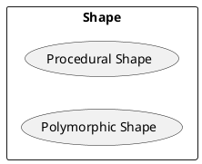
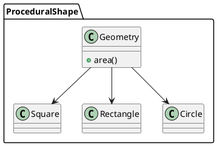
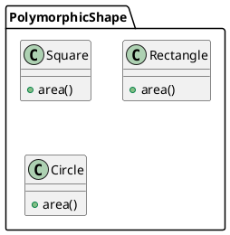

---
markdown:
  image_dir: /docs/dev/assets
  path: objects_and_data_structures.md
  ignore_from_front_matter: true
  absolute_image_path: false
---

構造化プログラミングとオブジェクト指向プログラミング
---

## 基本仕様
+ 図形の面積を計算できる
+ 図形の種類は正方形、長方形、円形

## ユースケース


### ユースケース１：構造化プログラミングによる実装
```ruby {cmd=true}
require 'test/unit'
require 'minitest/autorun'

class Geometry
  PI = 3.14

  def area(shape)
    if shape.instance_of? Square
      shape.side * shape.side
    elsif shape.instance_of? Rectangle
      shape.height * shape.width
    elsif shape.instance_of? Circle
      (shape.radius * shape.radius) * PI
    end
  end
end

class Square
  attr_accessor :side

  def initialize(side)
    @side = side
  end
end

class Rectangle
  attr_accessor :height,:width

  def initialize(height,width)
    @height = height
    @width = width
  end
end

class Circle
  attr_accessor :radius

  def initialize(radius)
    @radius = radius
  end
end

describe 'ProceduralShape' do
  describe '#area' do
    let(:geometry) { Geometry.new }
    let(:square) { Square.new(10) }
    let(:rectangle) { Rectangle.new(10,20) }
    let(:circle) { Circle.new(5) }

    it 'calculate area of square' do
      assert_equal 100, geometry.area(square)
    end

    it 'calculate area of rectangle' do
      assert_equal 200, geometry.area(rectangle)
    end

    it 'calculate area of circle' do
      assert_equal 78.5, geometry.area(circle)
    end
  end
end
```

### ユースケース２：オブジェクト指向プログラミングによる実装
```ruby {cmd=true}
require 'test/unit'
require 'minitest/autorun'

class Square
  attr_accessor :side

  def initialize(side)
    @side = side
  end

  def area
    @side * @side
  end
end

class Rectangle
  attr_accessor :height, :width

  def initialize(height, width)
    @height = height
    @width = width
  end

  def area
    @height * @width
  end
end

class Circle
  PI = 3.14

  attr_accessor :radius

  def initialize(radius)
    @radius = radius
  end

  def area
    (@radius * @radius) * PI
  end
end

describe 'PolymorphicShape' do
  describe Square do
    let(:square) { Square.new(10) }
    subject { square }

    it 'calculate area' do
      assert_equal 100, subject.area
    end
  end

  describe Rectangle do
    let(:rectangle) { Rectangle.new(10,20) }
    subject { rectangle }

    it 'calculate area' do
      assert_equal 200, subject.area
    end
  end

  describe Circle do
    let(:circle) { Circle.new(5) }
    subject { circle }

    it 'calculate area' do
      assert_equal 78.5, subject.area
    end
  end
end
````

## コアモデル




## 参照
+ [Clean Code アジャイルソフトウェア達人の技](https://www.amazon.co.jp/Clean-Code-%E3%82%A2%E3%82%B8%E3%83%A3%E3%82%A4%E3%83%AB%E3%82%BD%E3%83%95%E3%83%88%E3%82%A6%E3%82%A7%E3%82%A2%E9%81%94%E4%BA%BA%E3%81%AE%E6%8A%80-Robert-Martin/dp/4048676881)
