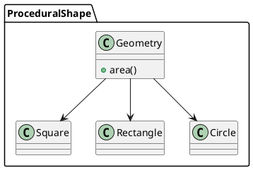

構造化プログラミングとオブジェクト指向プログラミング
---

## 基本仕様

+ 図形の面積を計算できる
+ 図形の種類は正方形、長方形、円形

## ユースケース


  

### ユースケース１：構造化プログラミングによる実装

```ruby
require 'test/unit'
require 'minitest/autorun'
class Geometry
  PI = 3.14
  def area(shape)
    if shape.instance_of? Square
      shape.side * shape.side
    elsif shape.instance_of? Rectangle
      shape.height * shape.width
    elsif shape.instance_of? Circle
      (shape.radius * shape.radius) * PI
    end
  end
end
class Square
  attr_accessor :side
  def initialize(side)
    @side = side
  end
end
class Rectangle
  attr_accessor :height,:width
  def initialize(height,width)
    @height = height
    @width = width
  end
end
class Circle
  attr_accessor :radius
  def initialize(radius)
    @radius = radius
  end
end
describe 'ProceduralShape' do
  describe '#area' do
    let(:geometry) { Geometry.new }
    let(:square) { Square.new(10) }
    let(:rectangle) { Rectangle.new(10,20) }
    let(:circle) { Circle.new(5) }
    it 'calculate area of square' do
      assert_equal geometry.area(square), 100
    end
    it 'calculate area of rectangle' do
      assert_equal  geometry.area(rectangle), 200
    end
    it 'calculate area of circle' do
      assert_equal geometry.area(circle), 78.5
    end
  end
end
```
<pre class="language-text">Run options: --seed 32607

# Running:

...

Finished in 0.001749s, 1715.2659 runs/s, 1715.2659 assertions/s.
3 runs, 3 assertions, 0 failures, 0 errors, 0 skips
</pre>

### ユースケース２：オブジェクト指向プログラミングによる実装

```ruby
require 'test/unit'
require 'minitest/autorun'
class AbstractMethodError < StandardError
end
class Shape
  def area
    raise AbstractMethodError
  end
end
class Square < Shape
  attr_accessor :side
  def initialize(side)
    @side = side
  end
  def area
    @side * @side
  end
end
class Rectangle < Shape
  attr_accessor :height, :width
  def initialize(height, width)
    @height = height
    @width = width
  end
  def area
    @height * @width
  end
end
class Circle < Shape
  PI = 3.14
  attr_accessor :radius
  def initialize(radius)
    @radius = radius
  end
  def area
    (@radius * @radius) * PI
  end
end
describe 'PolymorphicShape' do
  describe Shape do
    let(:shape) { Shape.new }
    it { assert_raises(AbstractMethodError) { shape.area } }
  end
  describe Square do
    let(:square) { Square.new(10) }
    subject { square.area }
    it { assert_equal subject, 100 }
  end
  describe Rectangle do
    let(:rectangle) { Rectangle.new(10,20) }
    subject { rectangle.area }
    it { assert_equal subject, 200 }
  end
  describe Circle do
    let(:circle) { Circle.new(5) }
    subject { circle.area }
    it { assert_equal subject, 78.5 }
  end
end
````
<pre class="language-text">Run options: --seed 28063

# Running:

....

Finished in 0.002267s, 1764.4464 runs/s, 1764.4464 assertions/s.
4 runs, 4 assertions, 0 failures, 0 errors, 0 skips
</pre>

## コアモデル
### ProceduralShape


### PolymorphicShape


  

## 参照

+ [Clean Code アジャイルソフトウェア達人の技](https://www.amazon.co.jp/Clean-Code-%E3%82%A2%E3%82%B8%E3%83%A3%E3%82%A4%E3%83%AB%E3%82%BD%E3%83%95%E3%83%88%E3%82%A6%E3%82%A7%E3%82%A2%E9%81%94%E4%BA%BA%E3%81%AE%E6%8A%80-Robert-Martin/dp/4048676881 )
